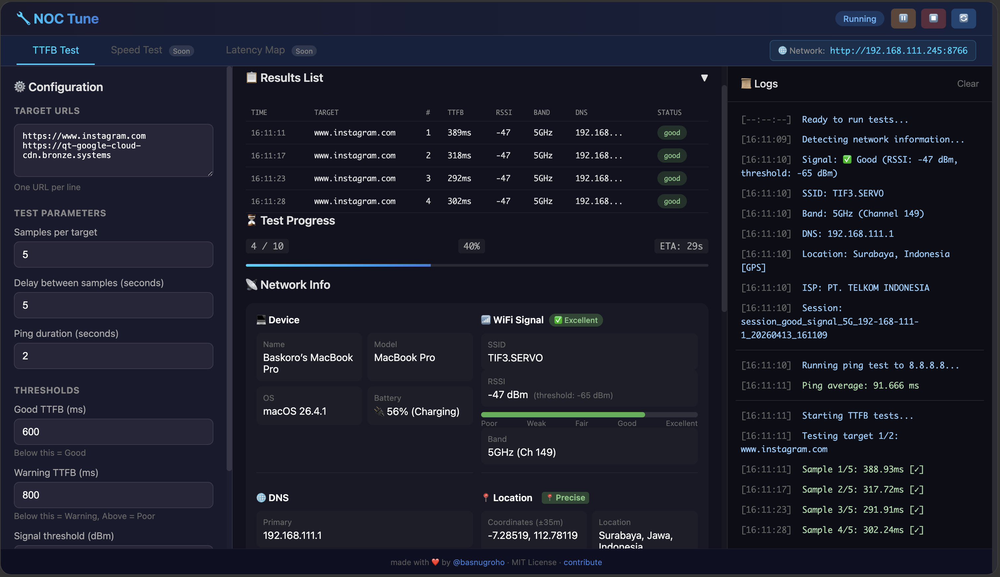
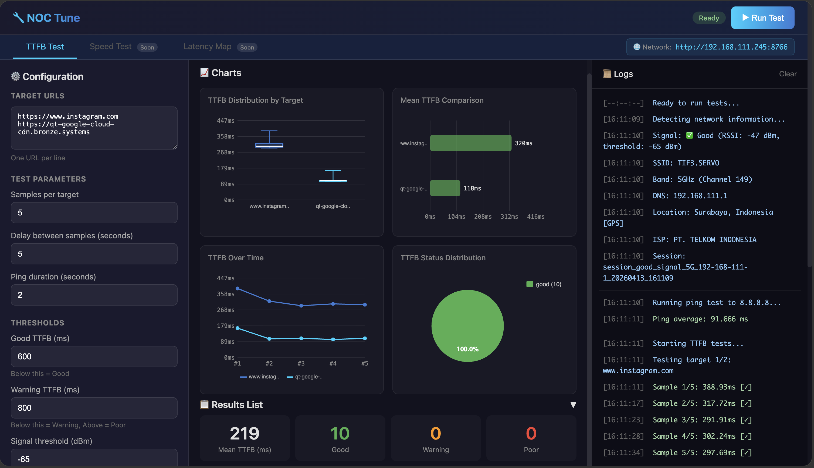
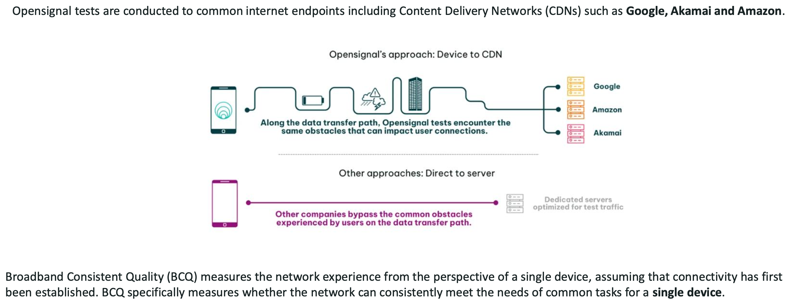
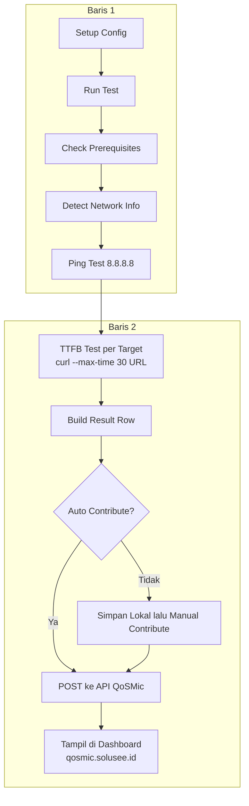

# NOC Tune

**Network Operations Center Tuning & Diagnostic Tool**

Tools untuk mengukur dan menganalisis kualitas jaringan secara komprehensif.

NOC Tune adalah aplikasi browser-based untuk mengukur TTFB secara otomatis, melihat konteks jaringan secara detail, dan menyimpan hasil dalam bentuk yang mudah dibaca. Tool ini cocok untuk validasi kualitas akses, troubleshooting, dan pengumpulan data teknis yang lebih rapi.

Made with ❤️ by [@basnugroho](https://github.com/basnugroho) · MIT License · [Contribute](https://github.com/basnugroho/noctune)

---

## 📸 Screenshots

### Browser UI - Running Test


### Browser UI - Final Results & Charts


### TTFB Analysis


### BCQ Analysis


---

## ℹ️ About

NOC Tune membantu Anda mengukur kualitas akses ke website atau endpoint tertentu dengan cara yang sederhana namun tetap detail.

- Mengukur TTFB secara otomatis ke satu atau banyak target.
- Mencatat konteks jaringan saat pengukuran berlangsung, seperti DNS, WiFi, perangkat, lokasi, ISP, dan IP publik.
- Menampilkan hasil secara real-time dalam tabel, summary, dan chart.
- Menyediakan export CSV dan report agar hasil mudah dibagikan atau dianalisis ulang.
- Mendukung contribute ke `qosmic.solusee.id` secara manual atau otomatis per row jika diaktifkan.

## ✅ Manfaat

- Lebih cepat melihat apakah masalah ada di akses target, DNS, WiFi, atau kondisi jaringan umum.
- Lebih mudah membandingkan hasil antar lokasi, antar waktu, atau antar band WiFi.
- Lebih rapi untuk membuat bukti teknis saat troubleshooting atau pelaporan.
- Lebih praktis karena satu UI sudah mencakup pengukuran, visualisasi, export, dan kontribusi data.

---

## 📋 Daftar Fitur

| Fase | Fitur | Status |
|------|-------|--------|
| 1 | Time to First Byte (TTFB) | ✅ Available |
| 2 | Latency | 🔜 Coming Soon |
| 3 | Packet Loss | 🔜 Coming Soon |
| 4 | Download Speed | 🔜 Coming Soon |
| 5 | Upload Speed | 🔜 Coming Soon |

## 🎯 Tujuan

Berdasarkan analisis TTFB troubleshooting, tools ini membantu:
- Mengidentifikasi bottleneck DNS (target: Lookup < 30ms)
- Mengukur first-mile quality (jitter, packet loss)
- Membandingkan performa 2.4GHz vs 5GHz WiFi
- Menganalisis Connect/TCP jitter (target: < 50ms)
- Validasi performa ke berbagai CDN (Google, Akamai, Amazon)

---

## 🚀 Quick Start

### Cara Tercepat (Browser UI)

```bash
# Clone repository
git clone https://github.com/basnugroho/noctune.git
cd noctune

# Buat virtual environment
python3 -m venv .venv
source .venv/bin/activate  # Linux/macOS
# atau: .venv\Scripts\activate  # Windows

# Install dependencies
pip install -r requirements.txt

# Jalankan UI
python main.py
```

Browser akan terbuka otomatis dengan tampilan:
- 📡 Network Info (signal, band, DNS, lokasi + peta)
- ⚙️ Configuration panel
- 📊 Real-time test results
- 📈 Chart visualizations
- 📥 Download CSV/Report
- 🤝 Auto/Manual contribute ke QoSMic (opsional)

---

## 🔄 Flow Sederhana



Alur singkatnya: user mengisi config, menjalankan test, tool melakukan ping dan curl TTFB, lalu hasil disimpan lokal dan bisa langsung dikirim ke API QoSMic agar muncul di dashboard.

## 🧰 Command Project

| Command | Fungsi | Keterangan |
|---------|--------|------------|
| `python main.py` | Menjalankan Browser UI | Entry point utama project |
| `python main.py --ui` | Menjalankan Browser UI | Sama seperti default command |
| `python main.py --port 8080` | Menjalankan UI di port tertentu | Default port adalah `8766` |
| `python main.py --location` | Mengambil GPS presisi via browser | Menyimpan ke `notebooks/precise_location.json` |
| `python main.py --check` | Mengecek prerequisite sistem | Validasi `curl`, `ping`, internet, WiFi, dan package opsional |
| `python main.py --version` | Menampilkan versi project | Shortcut: `python main.py -v` |
| `python -m ui.ttfb_test_ui` | Menjalankan server UI langsung dari module | Berguna untuk debug module UI |
| `python ui/get_location.py` | Menjalankan tool geolocation langsung | Alternatif langsung selain `--location` |

## 🧪 Command yang Dipakai Saat Runtime

| Area | Command / Request | Tujuan |
|------|-------------------|--------|
| Prerequisite | `curl --version` | Cek ketersediaan curl |
| Prerequisite | `ping -c 1 127.0.0.1` | Cek command ping di Linux/macOS |
| Prerequisite | `ping -n 1 127.0.0.1` | Cek command ping di Windows |
| Prerequisite | `HEAD https://www.google.com` | Cek koneksi internet |
| WiFi macOS | `networksetup -getairportnetwork en0` | Cek SSID WiFi |
| WiFi Windows | `netsh wlan show interfaces` | Cek status WiFi |
| DNS macOS | `scutil --dns` | Ambil DNS aktif |
| DNS Windows | `ipconfig /all` | Ambil DNS aktif |
| Ping test | `ping -c PING_DURATION 8.8.8.8` | Ukur latency dasar |
| Ping test Windows | `ping -n PING_DURATION 8.8.8.8` | Ukur latency dasar |
| TTFB test | `curl -o /dev/null -s -w ... --max-time 30 URL` | Ambil timing lookup, connect, TTFB, total |
| Contribute | `POST https://qosmic.solusee.id/api/ttfb-results/insert` | Kirim hasil ke QoSMic |

---

## 🌐 Remote Access (Raspberry Pi / Server)

NOC Tune dapat dijalankan di perangkat remote (seperti Raspberry Pi atau server) dan diakses dari device lain dalam satu jaringan.

### Setup di Raspberry Pi / Server

```bash
# SSH ke Raspberry Pi
ssh pi@192.168.1.100

# Clone dan setup
git clone https://github.com/basnugroho/noctune.git
cd noctune
python3 -m venv .venv
source .venv/bin/activate
pip install -r requirements.txt

# Jalankan server
python main.py
```

Output akan menampilkan:
```
🚀 Starting NOC Tune TTFB Test UI on port 8766...

   📍 Local:   http://localhost:8766
   🌐 Network: http://192.168.1.100:8766

   💡 Other devices on the same network can access via the Network URL
   Press Ctrl+C to stop
```

### Akses dari Device Lain

1. **Dari laptop/HP dalam satu WiFi**: Buka browser dan akses URL Network (contoh: `http://192.168.1.100:8766`)
2. **Custom port**: `python main.py --port 8080`

### Use Cases

| Skenario | Device Runner | Device Controller |
|----------|---------------|-------------------|
| Test WiFi di rumah | Raspberry Pi di pojok ruangan | Laptop/HP |
| Test kantor | Server Linux | Browser dari mana saja |
| Test multiple lokasi | Raspberry Pi di tiap lantai | Dashboard central |

### Tips untuk Raspberry Pi

```bash
# Install dependencies di Raspberry Pi OS
sudo apt update
sudo apt install python3 python3-pip python3-venv curl

# Jalankan di background
nohup python main.py > noctune.log 2>&1 &

# Cek log
tail -f noctune.log

# Stop server
pkill -f "python main.py"
```

---

## 📁 Struktur Project

```
noc_tune/
├── main.py                         # 🚀 Entry point utama
├── README.md                       # Dokumentasi project
├── requirements.txt                # Dependencies Python
├── .gitignore                      # Git ignore rules
├── core/                           # Core modules
│   ├── __init__.py
│   ├── config.py                   # Configuration management
│   ├── network.py                  # Network detection
│   └── ttfb.py                     # TTFB measurement
├── ui/                             # UI modules
│   ├── __init__.py
│   ├── ttfb_test_ui.py             # Browser-based TTFB UI
│   └── get_location.py             # GPS location via browser
├── images/                         # Screenshots
├── notebooks/                      # 📓 Jupyter notebooks
│   ├── ttfb_test.ipynb             # Notebook TTFB Testing
│   ├── config.txt                  # Konfigurasi test
│   └── results/                    # Hasil test per session
│       └── session_{signal}_{band}_{dns}_{timestamp}/
│           ├── session_info.json
│           ├── all_results_*.csv
│           ├── summary_*.csv
│           └── analysis_chart_*.png
└── docs/                           # Dokumentasi tambahan
```

---

## 🖥️ Command Line Options

```bash
python main.py                  # Jalankan UI (default)
python main.py --port 8080      # Custom port
python main.py --location       # Dapatkan GPS presisi via browser
python main.py --check          # Cek prerequisites saja
python main.py --version        # Tampilkan versi
```

---

## ✨ Fitur Browser UI

### Auto-Deteksi
- 📶 **Kekuatan sinyal WiFi** (RSSI dBm) dengan signal bar berwarna
- 📻 **Band WiFi** (2.4GHz / 5GHz) dari channel number
- 🌐 **DNS Server** yang sedang digunakan
- 📍 **Lokasi & ISP** via IP Geolocation + Browser GPS

### Control
- ▶️ **Run Test** - Mulai test TTFB
- ⏸️ **Pause** - Pause/resume test
- ⏹️ **Stop** - Stop test
- 🔄 **Restart** - Restart test

### Output
- 📊 Real-time results table
- 📈 Summary statistics (Mean, Good, Warning, Poor)
- 📥 Download CSV dengan data lengkap
- 📄 Download Report dengan analisis

---

## 📊 Fase 1: TTFB Testing

### 📁 Format Output Adaptif
Nama file dan folder otomatis menyesuaikan kondisi:
```
results/session_good_signal_5G_8-8-8-8_20260413_123456/
├── session_info.json               # Detail sesi lengkap
├── ping_result_5G_8-8-8-8.txt     # Hasil ping test
├── Target_1_instagram.com_5G.csv  # Data per target
├── all_results_good_signal_5G_8-8-8-8.csv
├── summary_good_signal_5G_8-8-8-8.csv
└── analysis_chart_good_signal_5G_8-8-8-8.png
```

### 📝 Config File (config.txt)
```txt
TARGETS = https://www.instagram.com, https://example.com
SAMPLE_COUNT = 10
AUTO_CONTRIBUTE = True
SIGNAL_THRESHOLD_DBM = -65
TTFB_GOOD_MS = 200
TTFB_WARNING_MS = 500
ONT_DNS = 8.8.8.8
BRAND = indihome
NO_INTERNET = 152606221682
```

### Parameter Testing
| Parameter | Default | Deskripsi |
|-----------|---------|-----------|
| `SAMPLE_COUNT` | 10 | Jumlah pengulangan test per target |
| `DELAY_SECONDS` | 2 | Jeda antar test (detik) |
| `PING_DURATION` | 10 | Durasi ping test (detik) |
| `AUTO_CONTRIBUTE` | True | Jika aktif, setiap row selesai langsung dikirim ke QoSMic |
| `SIGNAL_THRESHOLD_DBM` | -70 | Threshold good/bad signal |
| `TTFB_GOOD_MS` | 200 | TTFB dianggap baik jika < nilai ini |
| `TTFB_WARNING_MS` | 500 | TTFB dianggap warning jika < nilai ini |

---

## 📈 Interpretasi Hasil

### TTFB Thresholds
| Range | Status | Aksi |
|-------|--------|------|
| < 200ms | 🟢 Good | Optimal |
| 200-500ms | 🟡 Warning | Monitor |
| > 500ms | 🔴 Poor | Troubleshoot |

### Signal Strength
| RSSI | Status | Color |
|------|--------|-------|
| >= -50 dBm | Excellent | 🟢 Green |
| -50 to -60 | Good | 🟢 Light Green |
| -60 to -70 | Fair | 🟡 Yellow |
| -70 to -80 | Weak | 🟠 Orange |
| < -80 dBm | Poor | 🔴 Red |

### Root Cause Analysis
1. **DNS lambat** (Lookup > 30ms): Ganti ke public DNS (8.8.8.8 / 1.1.1.1)
2. **WiFi jitter** (Connect range besar): Pindah ke 5GHz, optimasi channel
3. **Path/CDN issue** (Server response tinggi): Cek peering, traceroute

---

## 🔧 Troubleshooting

### macOS: SSID tidak terdeteksi

SSID detection requires **Location Services** permission:

1. **System Settings** → **Privacy & Security** → **Location Services**
2. Enable Location Services
3. Scroll down and enable for **Terminal** (or the app running Python, e.g., VS Code, iTerm2)

Alternatively, install pyobjc for better WiFi detection:
```bash
pip install pyobjc-framework-CoreWLAN
```

### Windows: SSID tidak terdeteksi

SSID detection requires **Location Services** permission:

1. **Settings** → **Privacy** → **Location**
2. Turn on "Location for this device"
3. Turn on "Allow apps to access your location"
4. Enable for **Desktop apps** (at the bottom)

Alternatively, check via command line:
```cmd
netsh wlan show interfaces
```

### Windows: dig tidak ditemukan
```cmd
# Install via winget
winget install ISC.BIND
```

### Linux: Permission denied
```bash
# Pastikan curl terinstall
sudo apt install curl dnsutils
```

---

## 🧪 Requirements

- Python 3.8+
- curl (untuk TTFB measurement)
- Browser modern (untuk UI)

### Python Packages
```
pandas
numpy
matplotlib
seaborn
tqdm
requests
```

---

## 🛠️ Development

### Jupyter Notebook
Untuk analisis manual, gunakan notebook:
```bash
cd notebooks
jupyter notebook ttfb_test.ipynb
```

### GPS Presisi
Untuk lokasi GPS yang lebih akurat (±10m vs ±1km):
```bash
python main.py --location
```
Browser akan meminta izin lokasi.

---

## 📝 License

MIT License - see [LICENSE](LICENSE) for details.

---

## 🤝 Contributing

Contributions welcome! Please feel free to submit a Pull Request.

1. Fork the repository
2. Create your feature branch (`git checkout -b feature/AmazingFeature`)
3. Commit your changes (`git commit -m 'Add some AmazingFeature'`)
4. Push to the branch (`git push origin feature/AmazingFeature`)
5. Open a Pull Request

---

## 📞 Support

- Issues: [GitHub Issues](https://github.com/basnugroho/noctune/issues)
- Twitter: [@basnugroho](https://twitter.com/basnugroho)
